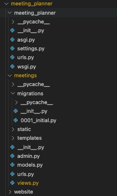

# Desciption
Django: Getting started course from [Django: Getting Started](https://app.pluralsight.com/course-player?clipId=d0873b64-cd0f-4348-8c6a-bc12e8d02d38) of PluralSight by Reindert-Jan Ekker and some other small projects with the goal to familiarize with the Django framework.

# Overview
Django is a web framework for Python. It offer many powerful features that can help kick-start your web projects. Some of the features django offer:
1. ORM
2. Admin interface
3. URL Mapping
4. Forms
5. Authentication
6. HTTP Handling

# Setup
The project use basic library to run such as: python, Django. You can install following the below steps

1. Create virtual environment
> python -m venv `<environment_name>`

2. Start the environment
> source `<environment_name>`/bin/activate

3. Install the requirements
> pip install -r requirements.txt

# Create new Django project
Django project can have one or many apps inside, each app execute specific usage. An app shouldn't do too many tasks ("If you cant describe a task of an app in single line the dont")

To create django project after installing requirements run the following command
> django-admin startproject `<project-name>`

To create app, after creating django project type the command
> python manage.py startapp `<app-name>`

## Project Structure


1. Manage.py used to interact with the django framework. Some common commands are
```
    python manage.py runserver                  : start server
    python manage.py startapp <app-name>        : create app
    python manage.py makemigrations             : create migration script based on class
    python manage.py migrate                    : execute migration from script
    python manage.py createsuperuser            : create super user for app
```

2. urls.py is used to config url for views model
3. In each app there is view file which used to handle logic from request
4. admin file is used to register model to admin page to interact (create, update, delete, ...)

# Model - Template -View (MTV)
Django follow repository design pattern, specifically Model-Template-View pattern

```
Model   : Handle interacting with database model
Views   : Handle logic (process, redirect, load, ...)
Template: Handle UI
```

After creating an app in django, give default files and folders. Here are some important files and folders
1. admin.py
2. views.py
3. templates
4. models

- In the views.py file, we add function to handle incoming request and after process the request choose to return the result either by string, dict or return to a specific page.
- The models.py, we create model class then later be initialize in the database by the use of "makemigration" and "migrate"
- admin.py give us a way to interact with the model (create, update, delete), but first need superuser access. This can be accomplished by using "createsuperuser"
- Creating **templates** folder and store html file for displaying the UI.

# URL-Mapping - Link Building
## URL-Mapping
In the views.py file, each function handle incoming request and then have the ability to return the result to specific url (either return directly or redirect to another page)
```
Note : Each app have their own views.py as well as templates
```

## Link building
Instead of passing the full path to the template file, in the urls.py we can specific the key name and give it the value

Each app have urls.py we can link to the urls.py of the main project by using include
> path('meetings/', include(meetings.urls))

# Templates extension
By defualt Django use JinJa template.

We can pass value to Jinja tempalte using special characters. For example some common cases:

```
           : include another template to current one
            : extend use template.html as base then add another element using 
  : For loop
                     : If condition
{{element}}                             : Pass in value from view
                : Look up url in urls.py
```

Django templates give use free control of value pass in, adding new templates, ...


# Workflow
1. Create new django project 
> django-admin createproject `<project-name>`
2. Create app for the project
> python manage.py startapp `<app-name>`
3. Define model class (if have)
4. Run migration scripts to update to database
```
python manage.py makemigrations
python manage.py migrate
```
5. Define views
6. Define template
7. Map views and templates (render, redirect, ...)
8. Register app in settings.py "INSTALLED_APP"
9. Register urls in urls.py
10. Run server
> python manage.py runserver